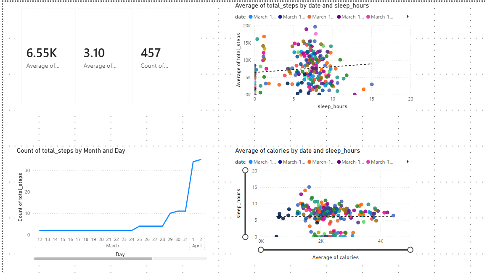
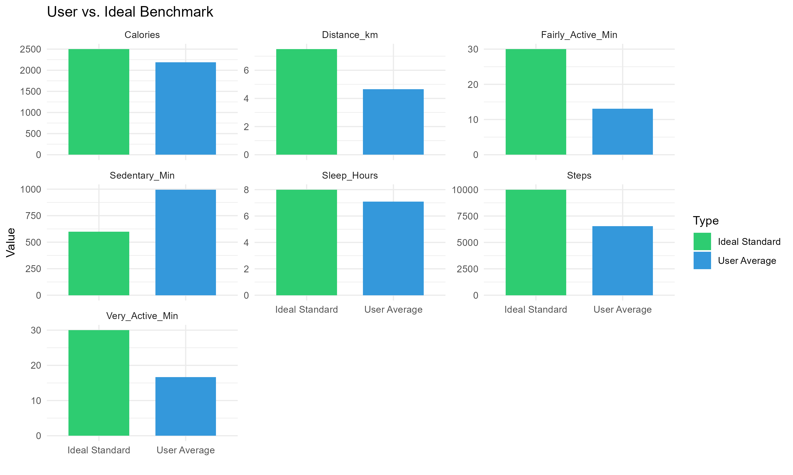
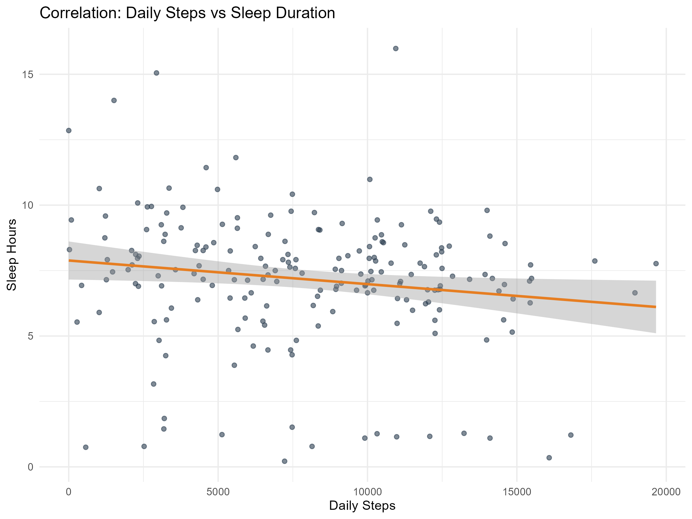
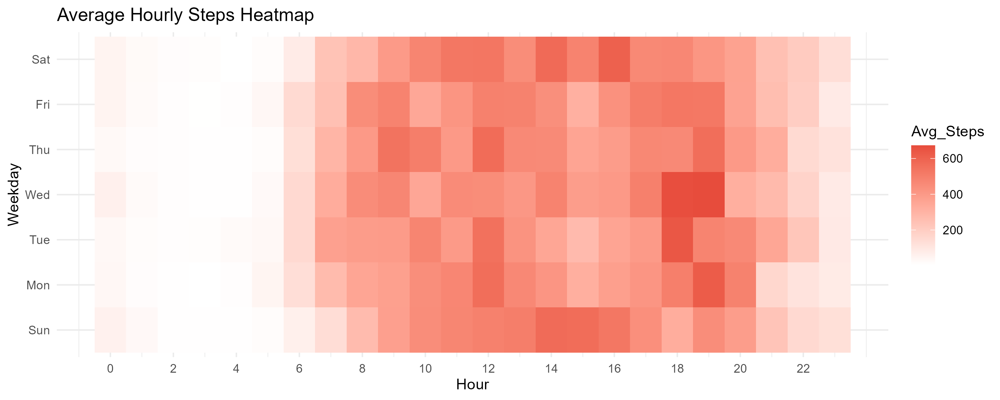
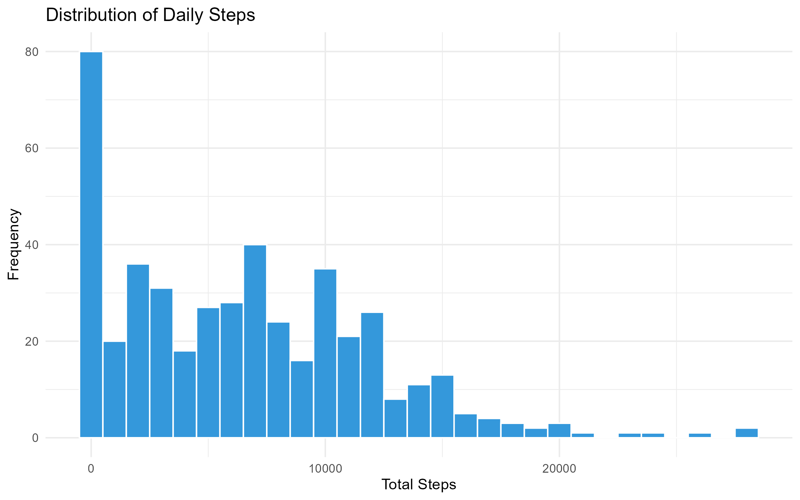
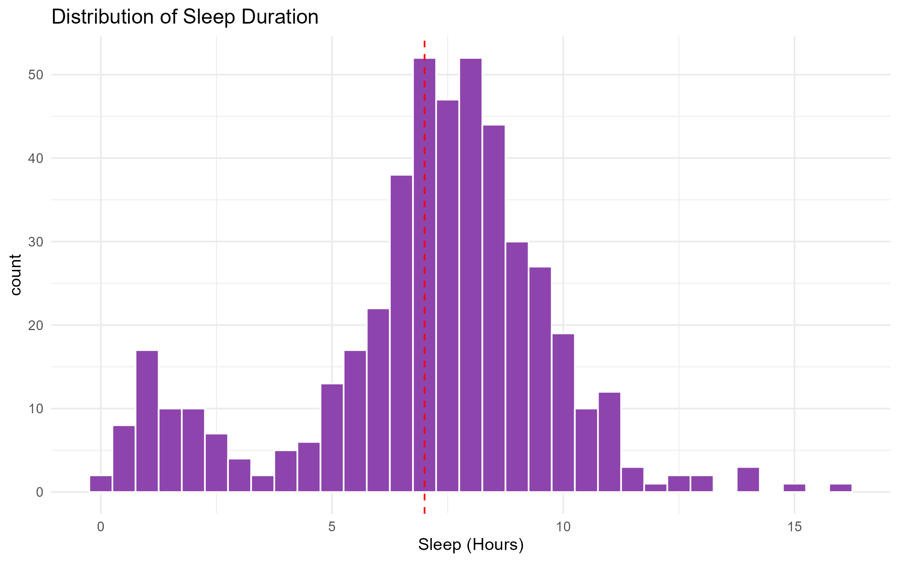

#  Fitness Band Data Insights Pipeline


> **An end-to-end analytics pipeline** that processes raw fitness tracker data, scores user health against ideal benchmarks, and visualizes trends in real-time using Power BI and R.


## Overview

This project is a full-stack data engineering and analysis solution designed to transform raw activity logs into actionable health insights. It simulates a real-world data environment where new data arrives daily, is processed by an **ETL pipeline**, stored in a **PostgreSQL warehouse**, and visualized in an interactive **Power BI Dashboard**.

### Key Features

*   **Automated ETL Pipeline**: Python scripts (`pandas`) clean and normalize raw CSV data, handling missing values and date parsing.
*   **Advanced Analytics**: R modules calculate complex metrics, including a **Composite Health Score**.
*   **3-Tier Recommendation Engine**: Classifies users into *High Performance*, *Maintenance*, or *Recovery Needed* based on their activity/sleep balance.
*   **Day-by-Day Simulation**: A custom PowerShell script (`simulate_day.ps1`) mimics the passage of time, releasing data incrementally to test real-time dashboard updates.
*   **Power BI Integration**: Pre-built SQL Views and DirectQuery setup for live reporting.

---

## Tech Stack

*   **Language**: Python 3.9+, R 4.x
*   **Database**: PostgreSQL 15 (Dockerized)
*   **Visualization**: Power BI, ggplot2 (R)
*   **Orchestration**: PowerShell / Python
*   **Containerization**: Docker Compose

---

## Visual Insights

The pipeline automatically generates static analysis plots in addition to the Power BI dashboard.

### Dashboard Preview


### 1. User vs Ideal Benchmarks
*How does the user compare to health standards (10k steps, 8h sleep)?*


### 2. Sleep Quality & Correlation
*Does more movement lead to better sleep?*


### 3. Activity Patterns
*Heatmap of activity intensity throughout the week.*


### 4. Distribution of Metrics
*Understanding the spread of daily steps and sleep duration.*
<p float="left">
  
   
</p>


## Getting Started

### Prerequisites
*   **Docker Desktop** (for the database)
*   **Python 3.x**
*   **R** (with `tidyverse` installed)
*   **Power BI Desktop** (Windows)

### 1.  Infrastructure Setup
Start the local PostgreSQL database:
```bash
docker compose up -d
```
*Creates a `fitdb` database on localhost:5432.*

### 2.  Install Dependencies
```bash
pip install -r requirements.txt
```

### 3. Run the Pipeline (Simulation Mode)
The coolest way to run this project is to use the **Day Simulation**. This script processes data one day at a time, calculating scores and updating the DB.

```powershell
.\scripts\simulate_day.ps1
```
*Run this command multiple times to advance the calendar and watch your dashboard evolve!*

---

## Power BI Setup

1.  Open **Power BI Desktop**.
2.  Connect to **PostgreSQL Database**:
    *   **Server**: `localhost`
    *   **Database**: `fitdb`
    *   **Creds**: `fituser` / `fitpass`
3.  Load the **`fit.vw_analysis_master`** view (pre-joined data).
4.  Load **`fit.scored_comparison`** for the benchmark charts.

*See [docs/POWER_BI_SETUP.md](docs/POWER_BI_SETUP.md) for a detailed walkthrough.*

---

## 📂 Project Structure

```
├── analysis/           # R Markdown research reports
├── data/               # Raw and Processed CSVs
├── etl/                # Python scripts for Extract-Transform-Load
├── visuals/            # Generated Plots & Power BI Project files
├── scripts/            # Orchestration & Scoring Logic (R/PS1)
├── sql/                # Database Schema & View Definitions
└── docker-compose.yml  # Database configuration
```

---

## 📜 License
MIT License. Free to use for educational and portfolio purposes.
